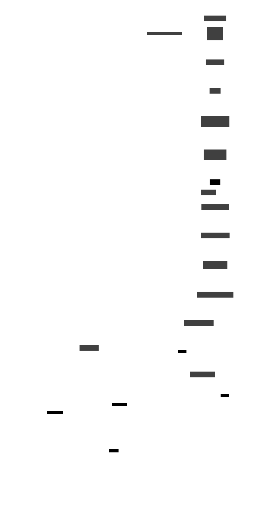
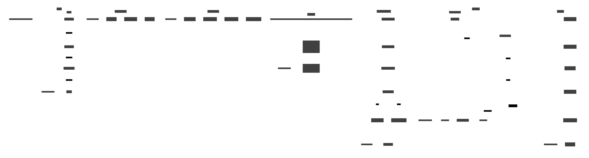
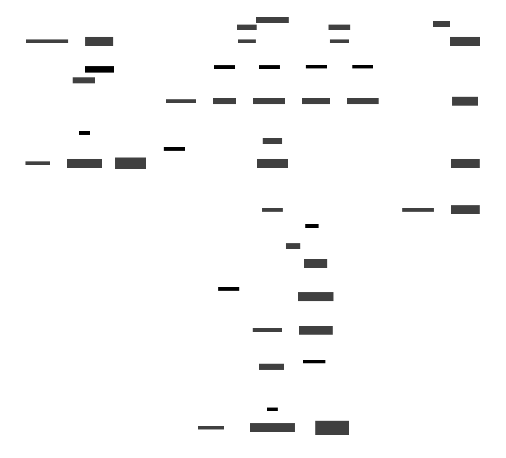

# Closure Architecture in Weave

This document provides a detailed technical overview of how closures are implemented in the Weave programming language interpreter. The implementation follows principles from "Crafting Interpreters" but is adapted for Rust's memory safety and ownership model.

## System Overview

Weave's closure system consists of three main layers:

1. **Compile-time Analysis**: Variable capture detection and upvalue metadata generation
2. **Runtime Creation**: Closure instantiation with upvalue initialization
3. **Variable Access**: Efficient access to captured variables through upvalues



## Core Components

### 1. Upvalue Bridge (`Upvalue`)

Located in `src/weave/vm/types/weave_fn.rs:32-60`

The `Upvalue` struct serves as a bridge between compilation and runtime, encoding metadata about captured variables:

```rust
pub struct Upvalue {
    pub(crate) idx: u8,           // Index in parent scope
    pub(crate) is_local: bool,    // Local var vs. parent upvalue
    pub(crate) original_idx: u8,  // Original local variable index
}
```

**Key Methods:**
- `Upvalue::local(idx)` - Captures a local variable from parent scope
- `Upvalue::remote(idx)` - Captures an upvalue from parent scope
- `to_bytes()` - Serializes upvalue metadata into bytecode
- `from_bytes()` - Deserializes upvalue metadata during VM execution

### 2. Runtime Container (`WeaveUpvalue`)

Located in `src/weave/vm/types/weave_upvalue.rs:8-42`

The `WeaveUpvalue` struct is the runtime container for captured variables:

```rust
pub struct WeaveUpvalue {
    value: Rc<RefCell<InnerUpvalue>>,
}
```

**Key Methods:**
- `WeaveUpvalue::open(idx)` - Creates upvalue pointing to stack slot
- `value(&self, vm)` - Gets current value of the upvalue
- `set(&mut self, value, vm)` - Updates the upvalue's value
- `close(&mut self, vm)` - Transitions from stack to heap storage

### 3. State Management (`InnerUpvalue`)

Located in `src/weave/vm/types/upvalues/inner.rs:8-11`

The `InnerUpvalue` enum manages the two possible states of an upvalue:

```rust
pub enum InnerUpvalue {
    Open(OpenUpvalue),    // Points to stack slot
    Closed(ClosedUpvalue) // Contains heap-allocated value
}
```

#### OpenUpvalue

Points directly to a stack slot when the captured variable is still on the stack:

```rust
pub struct OpenUpvalue {
    pub idx: usize  // Absolute stack position
}
```

#### ClosedUpvalue  

Contains a heap-allocated value when the captured variable has moved off the stack:

```rust
pub struct ClosedUpvalue {
    value: Rc<RefCell<WeaveType>>
}
```

### 4. Function Closure (`FnClosure`)

Located in `src/weave/vm/types/weave_fn.rs:79-89`

The `FnClosure` struct combines a function with its captured upvalues:

```rust
pub struct FnClosure {
    pub func: Rc<WeaveFn>,
    pub upvalues: Vec<WeaveUpvalue>
}
```

## Compilation Process

### Variable Capture Detection

The compiler (`src/weave/compiler/compiler.rs`) analyzes function definitions to identify variables that need to be captured:

1. **Scope Tracking**: Each function maintains a scope with local variables
2. **Name Resolution**: Variable references are resolved against the scope chain
3. **Upvalue Creation**: Variables from parent scopes become upvalues
4. **Deduplication**: Multiple references to the same variable share one upvalue

### Bytecode Generation

When a function with upvalues is compiled:

1. **Function Creation**: The function object is created with `upvalue_count`
2. **Closure Instruction**: `Op::Closure` is emitted with the function constant index
3. **Upvalue Metadata**: Each upvalue's `to_bytes()` data is appended to the instruction
4. **Constant Storage**: The function is stored in the constants table

Example bytecode for a closure:
```
OP_CLOSURE  [func_idx] [is_local_1] [idx_1] [is_local_2] [idx_2] ...
```

## Runtime Execution

### Closure Creation (`Op::Closure`)

Located in `src/weave/vm/vm.rs` (VM execution loop)

When `Op::Closure` is executed:

1. **Read Function**: The function constant is retrieved from the constants table
2. **Create Closure**: A new `FnClosure` is instantiated
3. **Process Upvalues**: For each upvalue in the function:
   - Read `is_local` and `idx` bytes from the instruction
   - If `is_local`: Create `WeaveUpvalue::open(absolute_stack_pos)`
   - If not `is_local`: Clone the upvalue from parent's upvalue array
4. **Stack Push**: The closure is pushed onto the stack

### Variable Access

#### Getting Upvalue (`Op::GetUpvalue`)

```rust
let upvalue = &current_frame.closure.upvalues[slot];
let value = upvalue.value(self);  // Delegates to InnerUpvalue
```

#### Setting Upvalue (`Op::SetUpvalue`)

```rust
let mut upvalue = current_frame.closure.upvalues[slot].clone();
upvalue.set(new_value, self);  // Updates underlying storage
```



### Upvalue State Transitions

#### Open → Closed Transition

When a function scope exits, open upvalues must be "closed" to move their values from the stack to the heap:

1. **Detection**: The VM identifies when stack slots are about to be popped
2. **Value Capture**: The current value is read from the stack slot
3. **Heap Allocation**: A new `ClosedUpvalue` is created with the value
4. **State Update**: The `InnerUpvalue` transitions from `Open` to `Closed`

This ensures captured variables remain accessible even after their original scope has exited.



## Memory Management

### Rust Safety Adaptations

Weave's implementation differs from traditional C implementations in several key ways:

#### Index-Based References
Instead of raw pointers, Weave uses stack indices for safety:
```rust
// Safe: Uses index to reference stack slot
struct OpenUpvalue { idx: usize }

// Unsafe C equivalent: ObjUpvalue { Value* location; }
```

#### Shared Ownership
Closed upvalues use `Rc<RefCell<>>` for safe shared mutable access:
```rust
struct ClosedUpvalue {
    value: Rc<RefCell<WeaveType>>  // Safe shared mutability
}
```

#### Clone-Based Updates
To avoid borrowing conflicts, upvalues are cloned when modified:
```rust
let mut upvalue = current_frame.closure.upvalues[slot].clone();
upvalue.set(value, self);  // No borrowing conflicts
```

## Stack Frame Layout

Weave uses a specific stack frame layout for function calls:

```
Stack Frame:
[0] - Function object (closure or function)
[1] - First parameter or local variable  
[2] - Second parameter or local variable
...
[N] - Last local variable
```

This layout affects upvalue index calculations during closure creation.

## Performance Characteristics

### Access Patterns

- **Open Upvalues**: Direct stack access - O(1) with minimal overhead
- **Closed Upvalues**: Heap access through `Rc<RefCell<>>` - O(1) with small allocation cost
- **Upvalue Creation**: Linear in number of captured variables - O(n)

### Memory Usage

- **Open Upvalues**: ~16 bytes (index + metadata)
- **Closed Upvalues**: ~24 bytes + value size (Rc + RefCell overhead)
- **Function Closures**: Function size + (upvalue_count * upvalue_size)

## Example: Counter Closure Execution

Consider this Weave code:
```weave
fn make_counter() {
    count = 0
    fn counter() {
        count = count + 1
        count
    }
    counter
}
```

### Compilation Phase

1. **Function `make_counter`**:
   - Local variable `count` at slot 1
   - Inner function `counter` captures `count`

2. **Function `counter`**:
   - One upvalue: `Upvalue::local(1)` (captures `count`)
   - Bytecode includes `OP_GET_UPVALUE 0`, `OP_SET_UPVALUE 0`

### Runtime Execution

1. **Call `make_counter()`**:
   - Stack frame: `[make_counter_fn, 0]` (count = 0 at slot 1)
   - Reach `OP_CLOSURE` for `counter`

2. **Closure Creation**:
   - Read upvalue metadata: `is_local=true, idx=1`
   - Create `WeaveUpvalue::open(1)` pointing to stack slot 1
   - Create closure with this upvalue

3. **Variable Access in `counter()`**:
   - `OP_GET_UPVALUE 0`: Read from upvalue 0 → stack slot 1 → value 0
   - `OP_SET_UPVALUE 0`: Write to upvalue 0 → stack slot 1 → value 1

4. **Upvalue Closing** (when `make_counter` exits):
   - Open upvalue transitions to closed
   - Value `1` is moved to heap storage
   - Future accesses read from heap instead of stack

## Testing and Validation

The implementation includes comprehensive tests in `src/weave/vm/vm.rs`:

- **`test_simple_closure`**: Basic closure functionality
- **`test_closures`**: Nested closures with multiple variable capture
- **Counter examples**: State persistence across multiple calls
- **Shared variable tests**: Multiple closures accessing the same variable

## Future Enhancements

### VM-Level Upvalue Deduplication

Currently, upvalue deduplication happens at compile-time. A future enhancement would add VM-level tracking to ensure multiple closures capturing the same variable share the same upvalue object.

### Optimized Upvalue Closing

The current implementation could be optimized to batch upvalue closing operations and use more efficient data structures for tracking open upvalues.

### Advanced Memory Management

Consider implementing upvalue pooling or more sophisticated garbage collection strategies for closed upvalues.

## References

- [Crafting Interpreters - Closures](https://craftinginterpreters.com/closures.html)
- [Upvalues Technical Documentation](../upvalues.md)
- Weave source code: `src/weave/vm/types/` and `src/weave/compiler/`